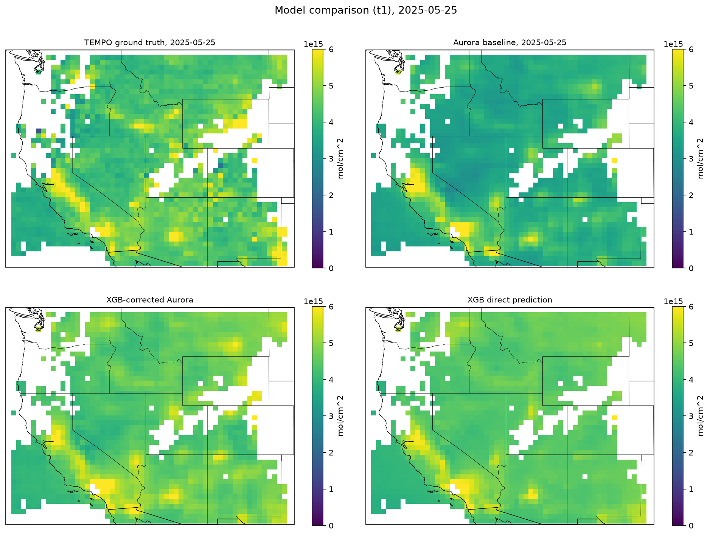

# Team-1
This github is for reproducibility and organization of files related to Team-1 of the Big Data REU at UMBC during the summer of 2026. 

TITLE: Machine Learning Approaches for NO2 Forecasting: Direct Model Predictions vs. Foundation Model with Residual Correction

Team Members: Ray Chen (1), Oscar Tuten (2), Michael Togbe (3), Aryan Poshtiwala (4), Adeline Barden (5)

RA's: Pavan Raj Ravi (6), Ruoyan Gong (7)

Mentor: Jianwu Wang (6)

Collaborators: Kyo Hugo Lee (8), Nicholas LaHaye (9), Xiaohua Pan (10), Hazem Mahmoud (11)

Affiliations: (1) Department of Computer Science, University of Maryland, College Park
(2) Department of Computer and Data Science, Goucher College
(3) Department of Computer Science and Electrical Engineering, University of Maryland, Baltimore County
(4) Clarksburg High School, Montgomery County, Maryland
(5) Department of Education, Troy University
(6) Department of Information Systems, University of Maryland, Baltimore County
(7) P.C. Rossin College of Engineering and Applied Science, Lehigh University 
(8) NASA Jet Propulsion Laboratory 
(9) Spatial Informatics Group, LLC 
(10) NASA Goddard Space Flight Center
(11) NASA Langley Research Center 

# Background 

Abstract: 

Accurate nitrogen dioxide (NO2) forecasting is critical for air quality management, yet training models from scratch is computationally expensive. Pretrained geo foundation models such as Microsoft’s Aurora can be applied to forecasting tasks without retraining. However, it remains unclear whether using a pretrained foundation model improves NO2 forecasting compared with direct machine learning approaches. This work compares two approaches for forecasting total column NO2 (tcNO2) over California. The first post-processes Aurora forecasts through residual correction using Copernicus Atmosphere Monitoring Service (CAMS) atmospheric as input features and NASA TEMPO satellite observations as ground truth. The second trains machine learning models to predict TEMPO tcNO2 directly from CAMS atmospheric inputs. Several machine learning models are trained and evaluated under both approaches to determine whether incorporating a pretrained foundation model produces forecasts that more closely match TEMPO observations than direct prediction from CAMS inputs.
 
This work is supported by the grant "REU Site: Online Interdisciplinary Big Data Analytics in Science and Engineering" from the National Science Foundation (grant no. OAC-2348755). We acknowledge the computational resources in the UMBC High Performance Computing Facility (hpcf.umbc.edu) and the financial contributions from NIH, NSF, CIRC, and UMBC for this work.

# Code Pipeline

This work uses multiple python scripts to organize and utilize the data collected from TEMPO and CAMS datasets for machine learning and direct prediction No2 forecasting. The below list is to show the pipeline for reproducibility and navigation of this repo. 

1. [Downloading](downloading/README.md)
   - CAMS
   - Aurora
   - TEMPO
  
2. [Preprocessing](preprocessing/README.md)
   - Filtering
   - Forecast
   - Organize
  
3. [Residual Correction Models](rcm_code/README.md)
   - XGBoost
   - Random Forest
   - Normalizing Flows
  
4. [Direct Prediction Models](dpm_code/README.md)
   - XGBoost
   - Random Forest
   - Normalizing Flows
  
# Running Code

Each folder in this github (other than output) will have a README.md for referencing running the important code. Originally, all of this code was run on a high performance computing system courtesy of UMBC, and so it might take longer or be more difficult to run without CPU delegation. The slurm jobs were made in order to batch and log on the system, and some of the python files are accompanied with these slurm files, and they are not to be used unless you are running it on a server that uses slurm for managing jobs. Regardless, they can all be run with Python 3 and are executable files. The most crucial aspect for running is changing all directory paths for consistency on your own system, and for creating the data sets from the satellite and Aurora data.  
